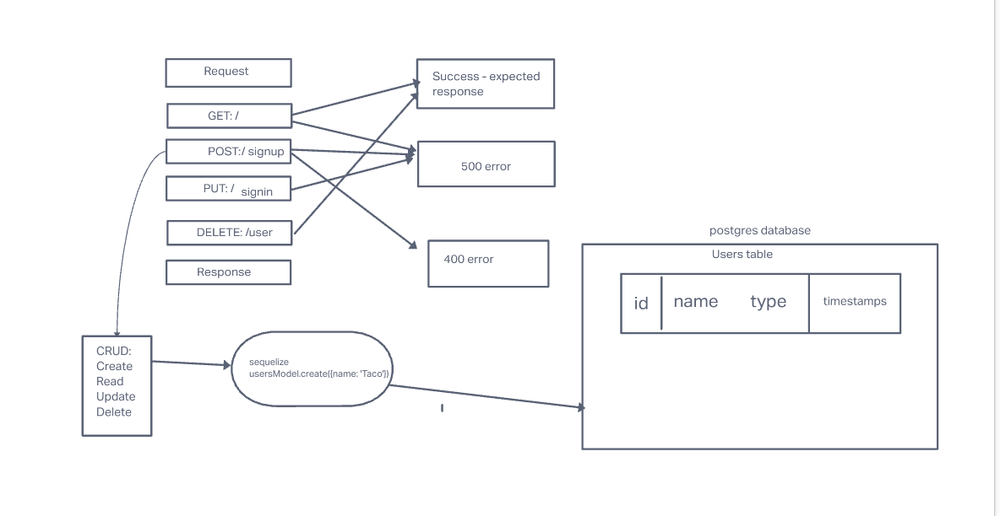

# LAB - Clas 06

## Project: basic-auth

### Author: Brenda Jow

### instructor: Ryan Gallaway

### Problem Domain  

Deploy an Express server that implements Basic Authentication, with signup and signin capabilities, using a Postgres database for storage.

### Links and Resources

- [GitHub Actions ci/cd](https://github.com/brenda70904/basic-auth/actions)

### Setup

#### `.env` requirements (where applicable)

PORT = 3001
DATABASE_URL=postgres://localhost:5432/basic-auth

#### How to initialize/run your application (where applicable)

- to start the server `nodemon`

#### How to use your library (where applicable)

#### Features / Routes

- Feature One: Details of feature
- GET : `/signup`
- POST : `/signin`

#### Tests

- How do you run tests?
`npm test`

#### UML

